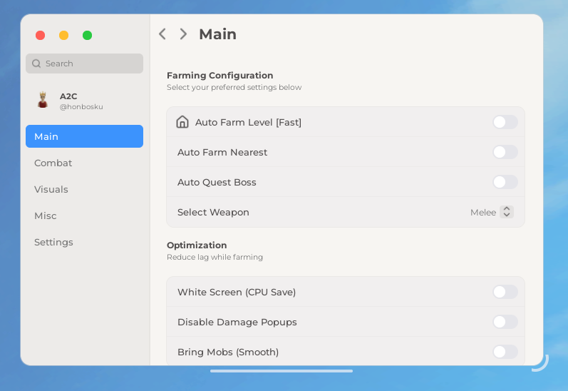

# Replica Mac Ventura System Settings UI Library 🍎

A modern, sleek, and macOS-inspired User Interface library for Roblox scripts. Designed for developers who want a clean, professional look for their hubs with built-in configuration handling.



## ✨ Features

- **MacOS Aesthetic**: Authentic look with "traffic light" window controls, sidebar navigation, and smooth animations.
- **Fully Interactive**: Draggable, Resizable, and Minimizable window.
- **Theme System**: Built-in `Light`, `Dark`, and `Purple` themes with dynamic switching.
- **Configuration Manager**: Easy Save/Load system using `Flags`.
- **Rich Elements**:
  - Toggles (Switch style)
  - Sliders (Draggable with fill)
  - Dropdowns (Modern selection)
  - Keybinds
  - Text Inputs
  - Buttons with Ripple effects
- **Notification System**: Built-in toast notifications.
- **Lucide Icons**: Integrated support for Lucide icons.

## 📦 Getting Started

To use this library in your script, `loadstring` the source (replace the URL with your actual raw file link):

```lua
local Library = loadstring(game:HttpGet("https://raw.githubusercontent.com/arsyny1x/replica-mac-ui/refs/heads/main/main.lua"))()
```

# 🛠️ Documentation

## 1. Create a Window
```lua
local Window = Library.CreateWindow({
	Title = "MacHub Premium",
	Size = UDim2.fromOffset(550, 350),
	Position = UDim2.fromScale(0.5, 0.5),
	AnchorPoint = Vector2.new(0.5, 0.5),
	Theme = "Light", -- Light, Dark, Purple
	ToggleKey = Enum.KeyCode.RightControl,
	Folder = "MacHub Premium",
})
```

#### Destroy Ui
```lua
Window.ScreenGui:Destroy() 
```

## 2. Create Profile
```lua
local Profile = Window:CreateProfileTab({
    Title = "Roblox ID",  
    --Name = "Roblox ID",    
    --Subtitle = "Level 999",    
    --Image = "rbxassetid://..."
})
```

## 3. Create a Tab
```lua
local MainTab = Window:CreateTab({
    Title = "Main",
    Subtitle = "Auto Farm & Stats",
    Icon = "lucide:a-arrow-up" -- Icon = "lucide:a-arrow-up" or Icon = "Solar:4-k-bold"
}) 
```

## 4. Add Elements

#### Section
Used to group elements visually.
```lua
MainTab:Section({ 
    Title = "Selection", 
    Subtitle = "Hello World" 
})

-- Update New Text
MainTab:SetText({ 
    Title = "Update Selection", 
    Subtitle = "The quick brown fox jumps over the lazy dog" 
})
```

#### Button
```lua
MainTab:Button({
    Title = "Button",
    Icon = "lucide:a-arrow-up" -- Icon = "lucide:a-arrow-up" or Icon = "Solar:4-k-bold"
    Callback = function()
        print("Button Cllicked")
    end
})
```

#### Toggle
Supports `Flag` for config saving.
```lua
MainTab:Toggle({
    Title = "Toggle",
    Icon = "lucide:a-arrow-up" -- Icon = "lucide:a-arrow-up" or Icon = "Solar:4-k-bold"
    Default = false,
    Flag = "Toggle", -- Unique identifier for config
    Callback = function(value)
        print("Auto Attack:", value)
    end
})
```

#### Slider
Supports `Flag` for config saving.
```lua
MainTab:Slider({
    Title = "Slider",
    Icon = "lucide:a-arrow-up" -- Icon = "lucide:a-arrow-up" or Icon = "Solar:4-k-bold"
    Min = 16,
    Max = 100,
    Default = 16,
    Flag = "Slider",
    Callback = function(value)
        print("Slider value:", value)
    end
})
```

#### Dropdown
Supports `Flag` for config saving.
```lua
local DropDown = MainTab:Dropdown({
    Title = "Select Weapon",
    Icon = "lucide:a-arrow-up" -- Icon = "lucide:a-arrow-up" or Icon = "Solar:4-k-bold"
    Values = {"Melee", "Sword", "Fruit"},
    Value = "Melee", -- Default
    Multi = true, -- Multiple selection
    Flag = "WeaponSelector",
    Callback = function(value)
        print("Selected:", value)
    end
})

-- Refresh Dropdown
DropDown:Refresh({"Player1", "Player2", "Player3", "NewPlayer"})
```
#### Selection Radio
```lua
MainTab:Radio({
    Title = "Select Mode",     
    Options = {"Legit", "Rage", "Semi-Rage"}, 
    Default = "Legit",         
    Flag = "Select Mode",     
    Callback = function(value)
        print("Selected Mode:", value)
    end
})
```


#### Textinput
```lua
MainTab:Input({ 
    Title = "Text input",
	Icon = "lucide:a-arrow-up" -- Icon = "lucide:a-arrow-up" or Icon = "Solar:4-k-bold"
	Callback = function(v) 
		print("New input:", v)
    end
})
```

#### Keybind
```lua
MainTab:Keybind({
    Title = "Toggle Menu",
    Icon = "lucide:a-arrow-up" -- Icon = "lucide:a-arrow-up" or Icon = "Solar:4-k-bold"
    Default = Enum.KeyCode.RightControl,
    ChangedCallback = function(newKey)
        print("New Keybind:", newKey)
    end
})
```

#### Popup
```lua
Window:ShowPopup("Hello World", "The quick brown fox jumps over the lazy dog", function()
    print("Confirm")
end, function()
    print("Cancel")
end)
```

#### 5. Configuration System
The library automatically handles saving and loading if you provide a `Flag` in your elements.

```lua
-- Save Settings
Window:SaveConfig("MyConfig")

-- Load Settings
Window:LoadConfig("MyConfig")

-- Set Theme
Window:SetTheme("Light") -- Light, Dark, Purple
```

## 6. Utilities

#### Notifications
Send a toast notification to the user.
```lua
Window:Notify("Title", "Message content here", 3) -- Title, Message, Duration (seconds)
```

#### Space
```lua
MainTab:Space()
```

#### Selecttab
```lua
MainTab:SelectTab()
```

#### Live Flags (Switch)
You can access or modify element values directly using `Window.Switch`. This is useful for loops or external scripts.

**Note:** You must assign a `Flag` to the element to use this feature.

```lua
-- Example Element
-- MainTab:Toggle({ Title = "Auto Farm", Flag = "FarmEnabled", ... })

-- Read value
if Window.Flags.FarmEnabled then
    print("Auto Farm is ON")
end

-- Set value (Updates UI automatically)
Window.Switch.FarmEnabled = false 
```

## 📜 Credits
Developed by **arsyny1x**.
